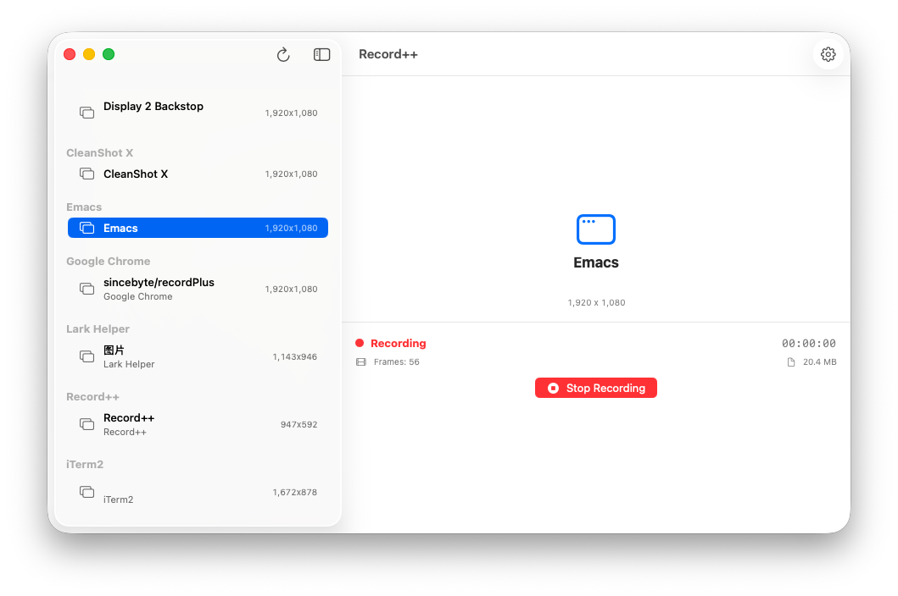

#+TITLE: Record++
#+SUBTITLE: macOS 原生窗口录制，带 Alpha 通道

* 简介

Record++ 是一款 macOS 原生窗口录制应用，基于 ScreenCaptureKit 和 Metal 实现 Chroma Key 色键抠像，将单个应用窗口录制为带 Alpha 透明通道的 ProRes 4444 视频，可直接导入 DaVinci Resolve / Final Cut Pro 中使用。

核心场景：录制 Emacs、Chrome、Terminal 等窗口，作为独立图层叠加到视频中，实现悬浮代码窗口效果。

* 架构

项目采用 SwiftUI + MVVM 架构，共 9 个模块：

| 模块             | 说明                       |
|------------------|---------------------------|
| App              | 应用入口，信号处理，崩溃捕获 |
| UI               | SwiftUI 视图与 ViewModel   |
| WindowManager    | SCShareableContent 窗口枚举 |
| Permissions      | 屏幕录制权限管理            |
| CaptureEngine    | SCStream 单窗口捕获         |
| AlphaGenerator   | Metal Compute Shader 色键抠像 |
| VideoEncoder     | AVAssetWriter ProRes 4444 编码 |
| ExportManager    | 输出文件管理与验证          |
| Utilities        | 日志、颜色、时间格式化      |

数据流：

#+begin_src text
SCStream (窗口捕获, BGRA)
  → AlphaGenerator (Metal Chroma Key)
  → CVPixelBuffer (BGRA + Alpha)
  → ProResEncoder (AVAssetWriter)
  → .mov (ProRes 4444, yuva444p10le)
#+end_src

* 功能

- 窗口列表：自动枚举当前所有可捕获窗口，按应用分组
- 单窗口捕获：基于 ScreenCaptureKit，仅捕获指定窗口
- 窗口跟踪：窗口移动/缩放时自动更新捕获区域
- Chroma Key 色键抠像：GPU 加速，可自定义键控色、阈值、平滑度、色溢抑制
- 圆角裁剪：自适应窗口圆角半径
- 自定义边框：可为窗口添加彩色边框
- 编码输出：ProRes 4444 (yuva444p10le)，支持 HEVC Alpha、ProRes 422
- 分辨率/帧率：1080p / 1440p / 2160p @ 30fps / 60fps
- 空白帧回退：窗口被遮挡时自动写入空白帧，保持连续时间线
- 输出验证：提供 ffprobe 验证脚本

* 编译

** 依赖

- macOS 14.0+
- Xcode 15.0+
- [[https://github.com/yonaskolb/XcodeGen][XcodeGen]]（可选，用于生成 Xcode 项目）

** 构建步骤

1. 安装 XcodeGen（如未安装）：
   #+begin_src bash
   brew install xcodegen
   #+end_src

2. 生成 Xcode 项目并打开：
   #+begin_src bash
   ./build.sh
   #+end_src

** Debug 构建（开发调试）

不加优化，编译快，含调试符号，适合日常开发。

#+begin_src bash
xcodegen generate
xcodebuild -project RecordPlusPlus.xcodeproj -scheme RecordPlusPlus -configuration Debug build
#+end_src

启动：
#+begin_src bash
open ~/Library/Developer/Xcode/DerivedData/RecordPlusPlus-*/Build/Products/Debug/Record++.app
#+end_src

** Release 构建（分发使用）

开启编译器优化，去除调试符号，性能更好，编译较慢。

#+begin_src bash
xcodegen generate
xcodebuild -project RecordPlusPlus.xcodeproj -scheme RecordPlusPlus -configuration Release build
#+end_src

启动：
#+begin_src bash
open ~/Library/Developer/Xcode/DerivedData/RecordPlusPlus-*/Build/Products/Release/Record++.app
#+end_src

* 使用

1. 启动应用，首次运行需授予屏幕录制权限。
2. 左侧边栏列出所有可捕获窗口，点击选择目标窗口。
3. 点击 =⚙= 图标打开设置面板，可配置：
   - 分辨率与帧率预设
   - 键控色（默认品红色 =#FF00FF=）
   - 阈值与平滑度
   - 色溢抑制
   - 圆角半径
   - 边框颜色与宽度
4. 点击录制按钮（或 =⌘R=）开始录制。
5. 点击停止按钮（或 =⌘S=）结束录制。
6. 输出文件保存在桌面，命名格式：=record_plus_plus_output_yyyyMMdd_HHmmss.mov=。

* 许可证

MIT License
